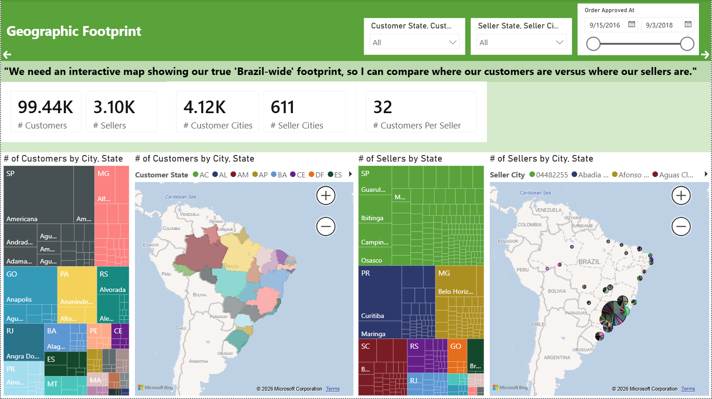
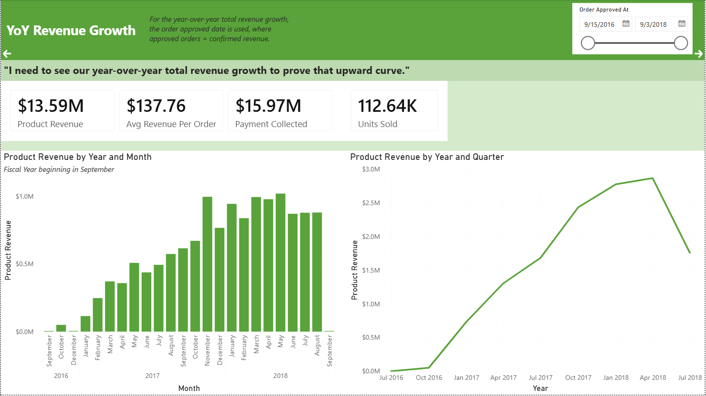
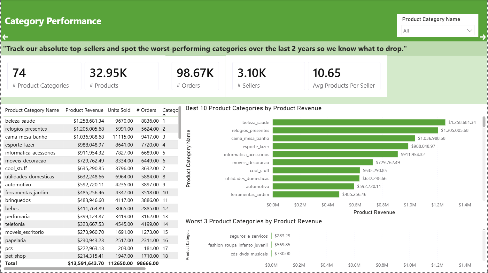
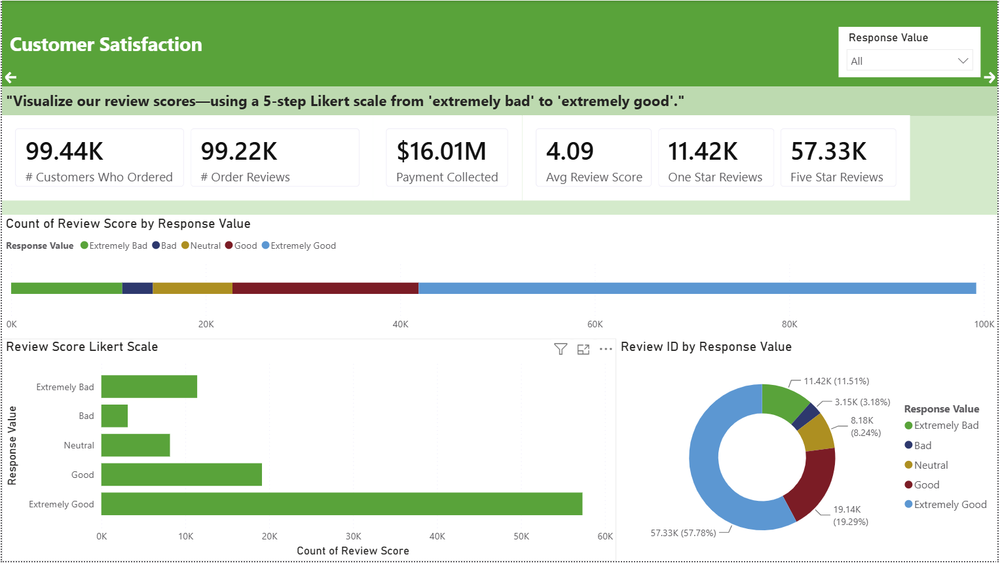
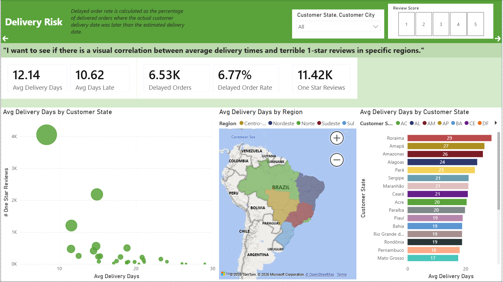

# Power BI Business Analysis

## Overview
Developed an interactive business intelligence report to evaluate business performance, transform transactional data into accessible visualizations and performance metrics, and communicate insights to decision-makers.

## Business Questions
The analysis addressed several business scenarios, including: 
- **Sales Performance**: Evaluate sales and revenue across products, categories, and time periods.
- **Product Performance**: Compare product categories and identify differences in performance.
- **Customer Analysis**: Examine customer activity and geographic patterns.
- **Seller Performance**: Evaluate seller activity and performance.
- **Delivery & Operations**: Analyze order and delivery information to identify operational trends.
- **Customer Experience**: Examine customer review data to better understand satisfaction.
  
## Methodology
The report connects multiple areas of the ecommerce database to support analysis across different business functions. Relationships between transactional and descriptive tables allow users to examine metrics across multiple dimensions. This relational structure allows dashboard visuals and filters to interact with the underlying data and provides a consistent foundation for business analysis. DAX measures and calculated fields were used to transform underlying data into business metrics for the report.

## Key Findings
- **Geographic Concentration**: Customer activity is concentrated in a relatively small number of Brazilian states. The geographic analysis shows substantial differences in customer and seller distribution across the country, highlighting the importance of regional market performance.

- **Strong Revenue Growth**: The business generated approximately *$13.59M in total product revenue* across the reporting period. Revenue increased substantially through 2017 and into 2018 before declining near the end of the available period.

- **Product Performance Varies Significantly by Category**: The dataset contains *74 product categories*, with approximately *$13.59M in product revenue* and *98.67K orders* represented in the category analysis. Revenue is concentrated among several leading categories, while the lowest-performing categories contribute only a small share of overall product revenue.

- **Customer Satisfaction Is Generally Positive**: The business has an *average review score of 4.09 out of 5* across approximately *99.44K customer reviews*. Positive ratings make up the largest portion of the review distribution, although the dataset also contains a meaningful number of low-scoring reviews that may warrant further investigation.

- **Delivery Performance Is Uneven and Presents an Operational Opportunity**: Delivery times vary considerably across customer locations. The geographic and state-level delivery analysis suggests that some regions experience substantially longer average delivery times than others, providing potential targets for further logistics analysis and process improvement. Orders took an average of approximately *13.73 days to arrive*, with about *10.62 days spent in the logistics process after shipment*. Approximately *6.77% of orders were delivered late*, indicating an opportunity to investigate regional and operational factors associated with delayed deliveries.

## Project Files
- `Power BI Brazilian Ecommerce Analysis.pbix` — Power BI dashboards created for the analysis
- `Images` — Selected report pages and visualizations
  
## About This Project
This project was originally completed as part of my university coursework. It has been reorganized and documented here as a portfolio project to demonstrate practical Power BI data modeling, visualization, and business analysis skills.

This project uses the same ecommerce dataset as my [SQL Business Analysis](https://github.com/dmbailey239/sql-brazilian-ecommerce-analysis) project. While the other project focuses on querying relational data to answer business questions, this project focuses on data modeling, DAX, visualization, and interactive business intelligence reporting.
